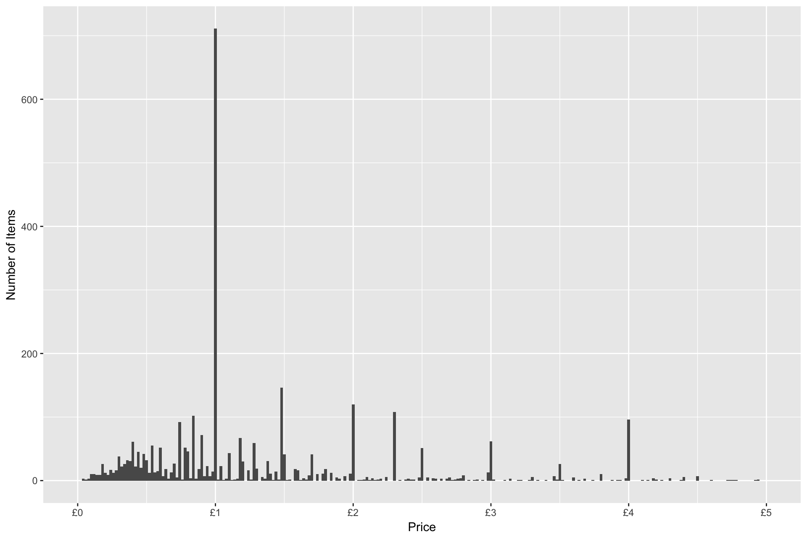
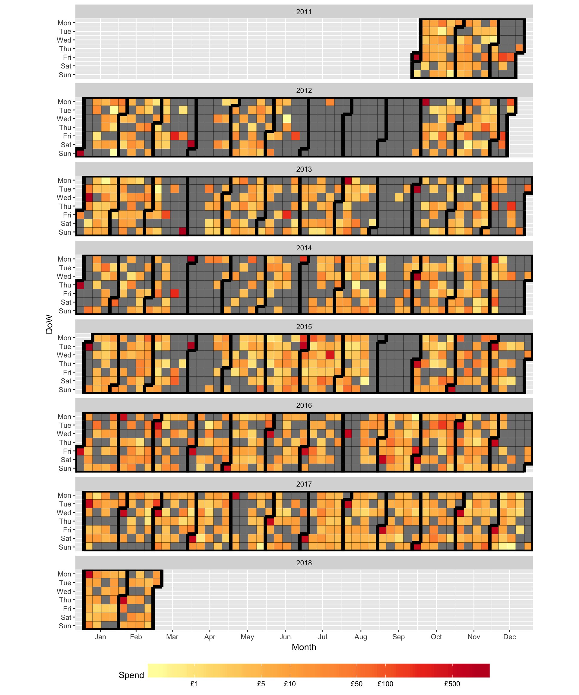
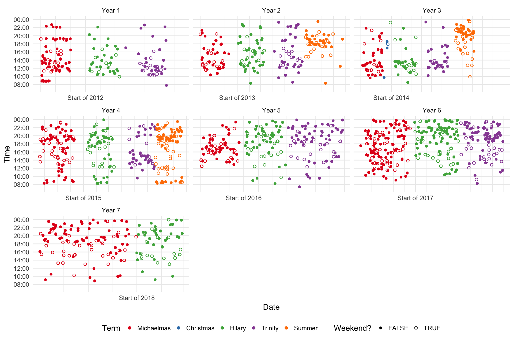
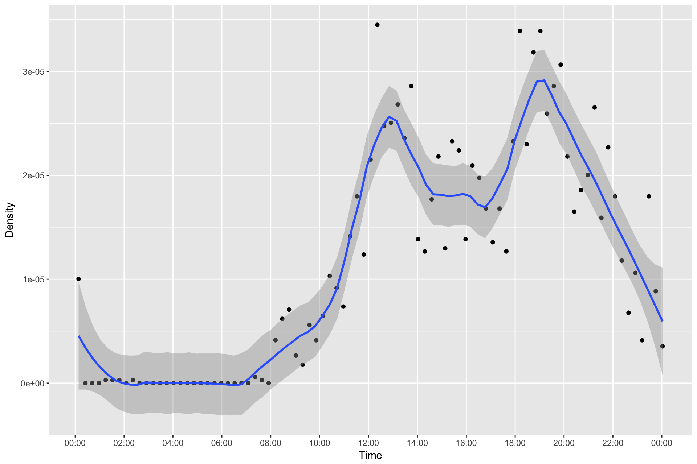
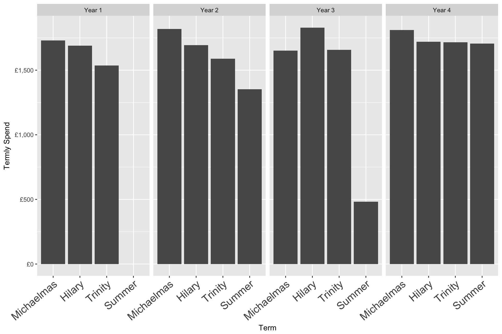
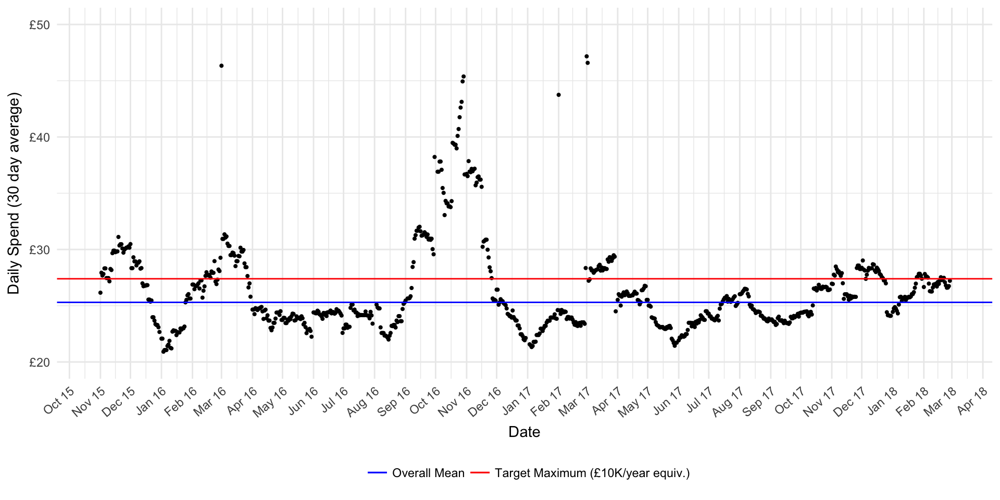
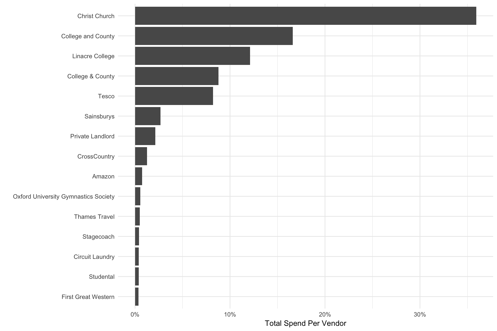
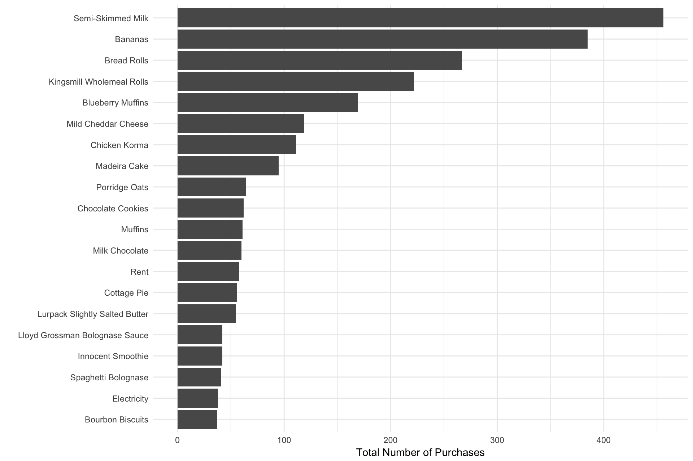

Spending Habits
================

Since 2011 I have been keeping meticulous records of everything I spend money on. I really mean everything, including, for example, the 6 pence I spent on a 75g carrot which I bought at 7:47pm on the 2nd of August 2014 at Tesco Cowley Road Metro! There's a total of 1419 recipts for 3713 items covering a duration of 5 and a half years. The code to repoduce this analysis can be founnd in the [.Rmd](Finance.Rmd) file.

Looking at the distribution of item prices integer values (£1, £2 etc.) are more common, as well as 25p and 50p increments. I guess consumers prefer round numbers so companies size products accordingly (or just round up and take the difference as profit).

Looking at the daily spend over time clearly shows the periods I was at university and the periods I was at home (with food etc. paid for by my parents) by the gaps where daily spending is £0. You can also see the peak in expenditure at the start of each month due to rent payments.

There are also time of day patterns for example during the summer terms when I did internships I didn't buy anything between 9am and 5pm on weekdays because I was working. Aggregating over all years it seems my favourite shopping times are 1pm and 7pm (lunch and dinner!).

The total spend per term is remarkably constant during my undergraduate years apart from summer of year 3 when my accommodation was heavily discounted. 

Now I've graduated I can keep track of my spending continuosly rather than termly. Although there are fluctuations, (for example in October 2016 I went to Vancouver), my spending is nicely centered slightly below my target.

Breaking down my spending by category, Rent accounts for over 70% of my spending followed by Food at ~15%.

Looking at total spend per vendor the top three vendors simply reflect my rental expenditure, followed by Tesco's and Sainsbury's where I do my grocery shopping.

My most commonly bought items are milk, bananas and bread.

