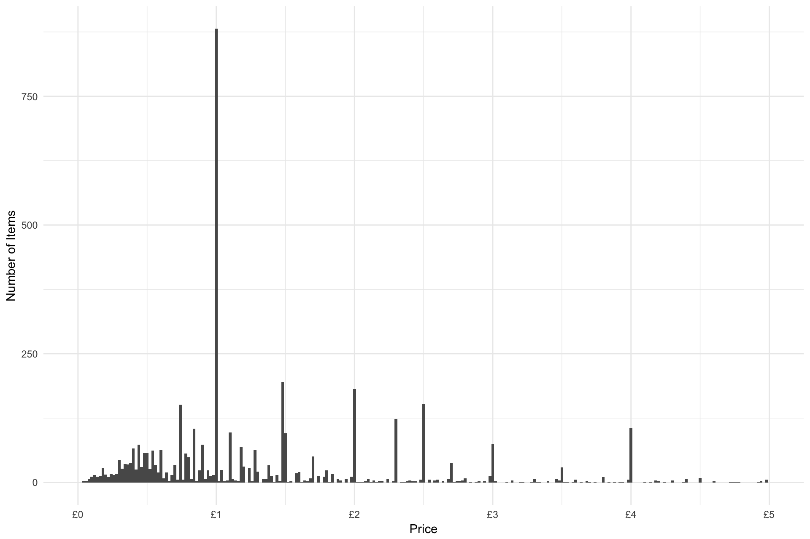
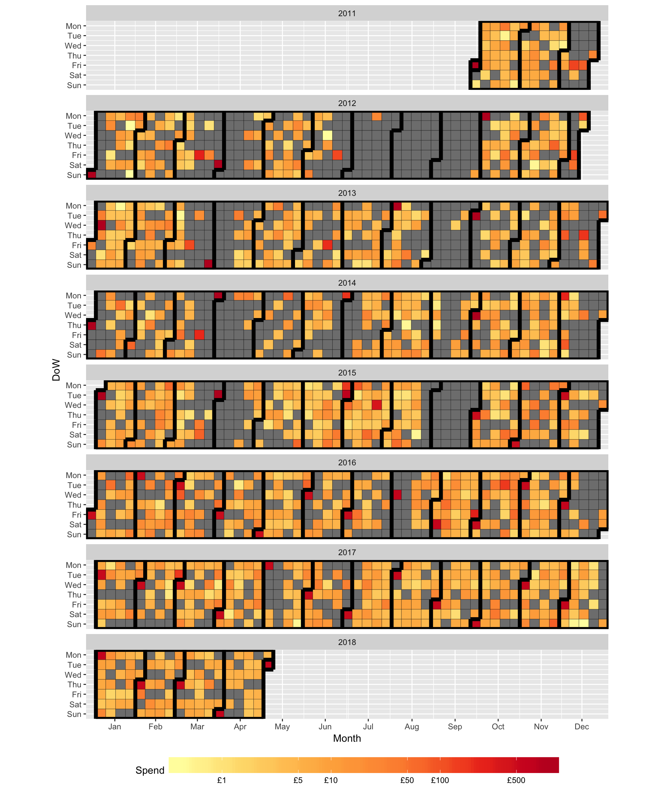
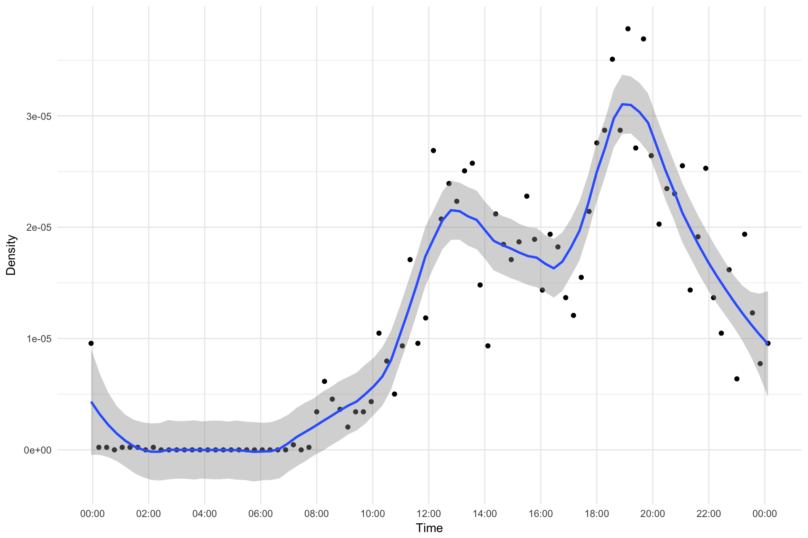
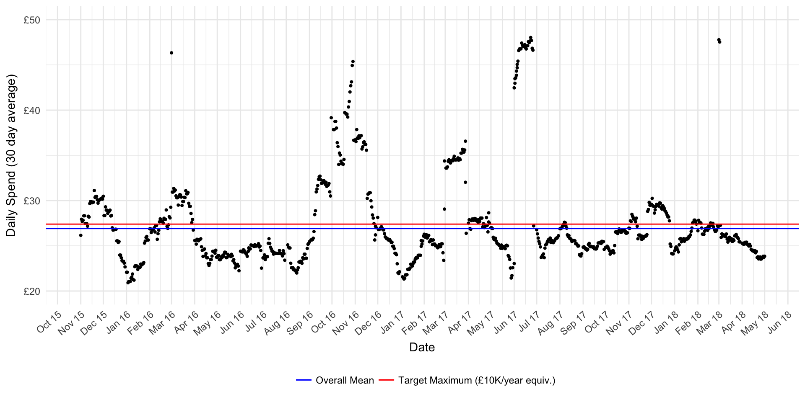
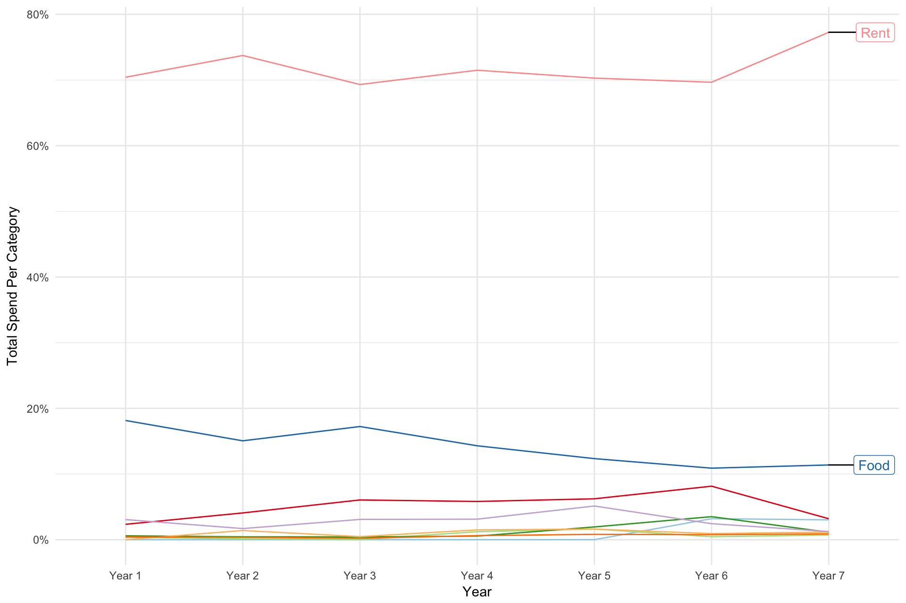
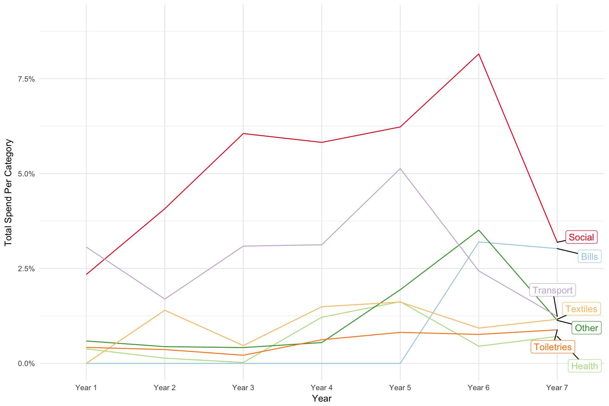
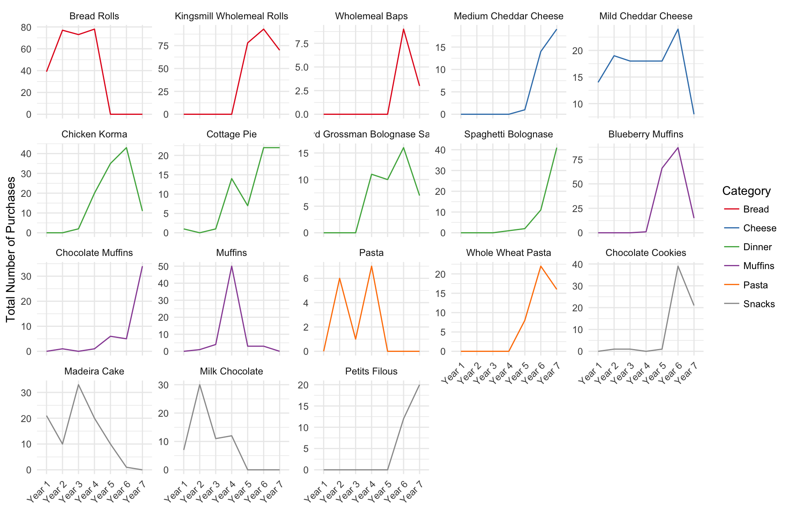
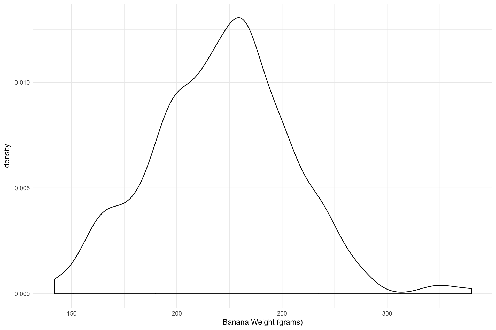

Spending Habits
================

Since 2011 I have been keeping meticulous records of everything I spend
money on. I really mean everything, including, for example, the 6 pence
I spent on a 75g carrot which I bought at 7:47pm on the 2nd of August
2014 at Tesco Cowley Road Metro\! There’s a total of 1850 recipts for
4803 items covering a duration of 6 and a half years. The code to
repoduce this analysis can be founnd in the [.Rmd](Finance.Rmd) file.

Looking at the distribution of item prices integer values (£1, £2 etc.)
are more common, as well as 25p and 50p increments. I guess consumers
prefer round numbers so companies size products accordingly (or just
round up and take the difference as profit).

Looking at the daily spend over time clearly shows the periods I was at
university and the periods I was at home (with food etc. paid for by my
parents) by the gaps where daily spending is £0. You can also see the
peak in expenditure at the start of each month due to rent payments.

There are also time of day patterns for example during the summer terms
when I did internships I didn’t buy anything between 9am and 5pm on
weekdays because I was working. Aggregating over all years it seems my
favourite shopping times are 1pm and 7pm (lunch and dinner\!).

My daily spending is nicely centered slightly below my target of
10k/year. The spike in spending in October 2016 is when I went to
Vancouver.

Breaking down my spending by category, Rent and bills account for 80% of
my spending followed by Food at just over
10%.

My most commonly bought items are milk, bananas and bread.

It’s fun to see how my purchasing habits have changed over time.

As I also recorded the weights I can calculate, for example, the average
weight of a banana. Although I select large bananas to maximise banana
to peel ratio so this is a biased sample.

